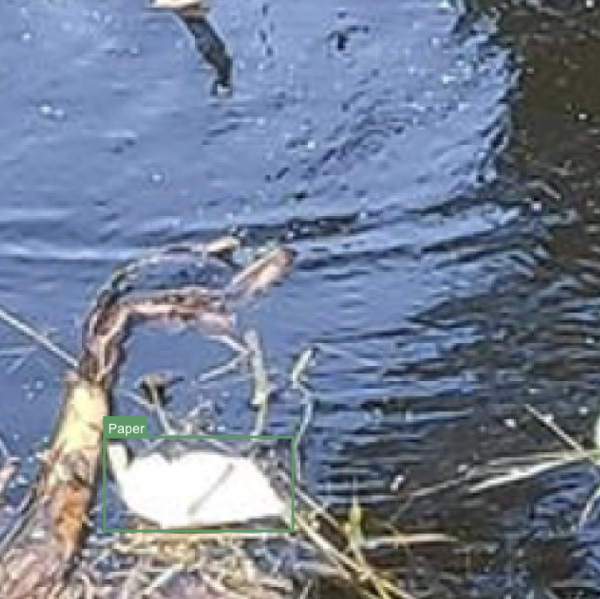

This is a detailed report around using YOLO-NAS and WandB together to perform a real-world task. 

# Introduction

This blog was written in the form of WandB Reports, which is a beautiful way to document your entire project journey from scratch. Support for embedding experiment tracking data right into the document makes it unparalleled for analysis.

# Tackling Water Pollution using YOLO-NAS and W&B

My first blog on Fully Connected details how you can get started with creating an end-to-end object detection pipeline using YOLO-NAS from SuperGradients and use WandB as an integrated platform for experiment creation, tracking, hyperparameter tuning, and visualization.

Read the original article here on [WandB Fully Connected](https://wandb.ai/ml-colabs/fconn-yolo-nas/reports/Tackling-Water-Pollution-using-YOLO-NAS-and-W-B--Vmlldzo2MDEzMzk1).