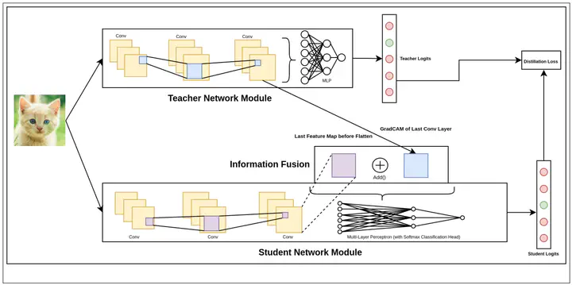

In the pursuit of model compression techniques, Knowledge Distillation emerges as an effective strategy for developing compact neural network models. This approach primarily revolves around the minimization of a loss function that quantifies the disparity between the Prediction Logits generated by a larger Teacher network and those produced by a smaller Student network. In our research, we propose an enhancement to this method by incorporating the GradCAM (Gradient-weighted Class Activation Mapping) technique from the field of Model Explainability. This augmentation involves leveraging GradCAM as an additional input to the Student network for improved learning. Notably, our findings reveal that this approach facilitates expedited convergence, particularly when the Teacher network exhibits strong performance and a substantial size advantage over the Student network.