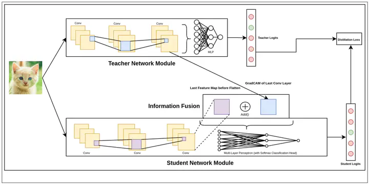

Document Translations are considered to be an unsolved problem with respect to dependable translations across languages. This process is time-consuming in nature and requires human intervention, primarily due to the inability of current methods to develop an understanding of the local context within the document. This is also a problem from the lens of accessibility, as a large section of the human population does not know English. In our work, we demonstrate how our proposed method, termed Project Lingua Franca, has the ability to generate document translations in a cheap and fairly efficient method,with no prior training and in Zero-shot settings.